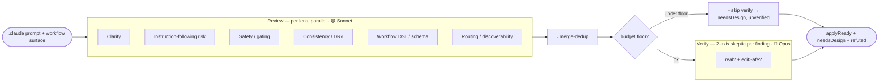
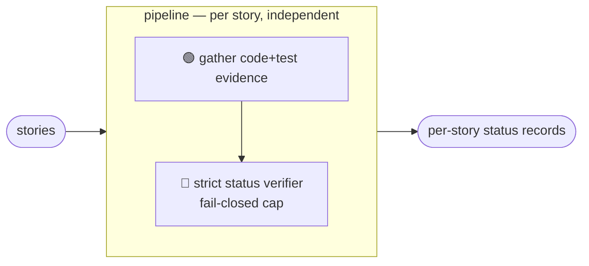
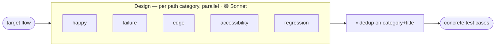
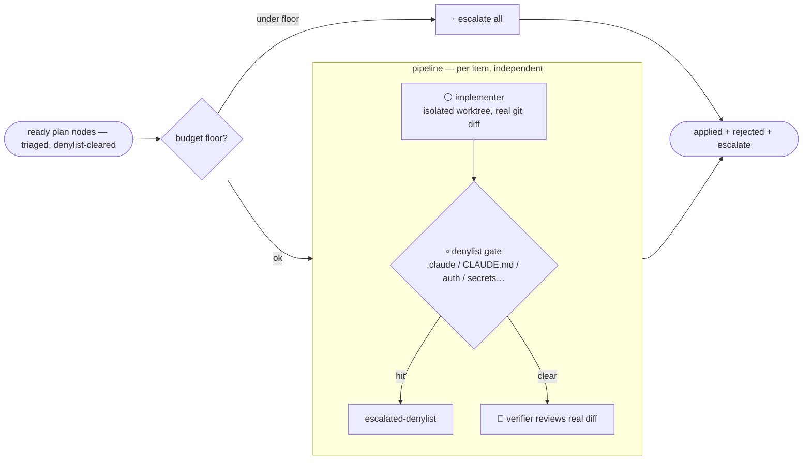

# Workflow graphs

Visual map of every deterministic multi-agent Workflow under `.claude/workflows/`.
Each is a **graph**: nodes = subagents (own context), edges = data hand-offs. This is
the "see the graph before you run it" view (the diagram-first idea from graph
engineering), kept in-repo so it version-controls alongside the scripts.

**Model tiering** (graph-engineering convention): high-volume fan-out runs on the
**fast tier** (Sonnet); gates, judgment, and synthesis run on the **strong tier**
(Opus). The loop implementer is the deliberate exception — it writes real code, so it
inherits the session model instead of being downgraded. All tiers are overridable via
`args.models = { fanout, judge }`.

> Legend: 🟢 fast tier (Sonnet) · 🔵 strong tier (Opus) · ⚪ inherits session model ·
> ▫️ plain code (no agent). Barriers (`parallel`) collect all nodes before the next
> stage; pipelines (`pipeline`) flow each item through independently.

---

## `critic-panel` — critic round (`/critic-round`, `/multi-agent-dev`, `/qa-pass`, `/loop`)

```mermaid
flowchart LR
  focus([focus / changed files]) --> R
  subgraph R["Review — parallel barrier · 🟢 Sonnet"]
    c1[First-Time User]
    c2[UX Flow]
    c3[Designer]
    c4[Artistic Direction]
    c5[Frontend Arch]
    c6[QA / E2E]
    c7[Accessibility]
    c8[Performance]
    c9[Security]
    c10[Regression]
  end
  R --> dedup[▫️ merge-dedup<br/>keep corroborating critics]
  dedup --> V
  subgraph V["Verify — one skeptic per blocker/important · 🔵 Opus"]
    v1[refute finding #1]
    v2[refute finding #2]
    vn[refute finding #N]
  end
  V --> out([confirmed matrix + niceToHaves + refuted])
```

> `uiInScope: false` drops the 5 UI-facing critics (First-Time User, UX Flow, Designer,
> Artistic Direction, Accessibility) from the Review fan-out for non-UI (backend / docs /
> config) changes — the 10-node graph above is the default/full case.

## `improve-skills` — meta-critic over our own prompts (`/improve-skills`)

## `scan-docs` — evidence-based story status (`/scan-project-docs`)

## `gap-analysis` — docs↔code↔tests gaps (`/story-gap-analysis`)

## `e2e-design` — Playwright case enumeration (`/multi-agent-e2e`)

## `loop-iteration` — maker/checker for `/loop` L2/L3

---

## How to regenerate

These diagrams are hand-maintained to mirror `.claude/workflows/*.js`. When you add a
node, change a tier, or add an edge, update the matching diagram here. `/improve-skills`
(Consistency lens) and `/dream lint` should flag a diagram that has drifted from its
script.
