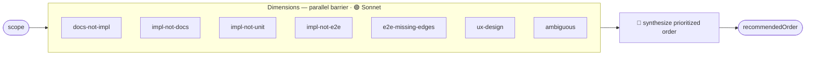
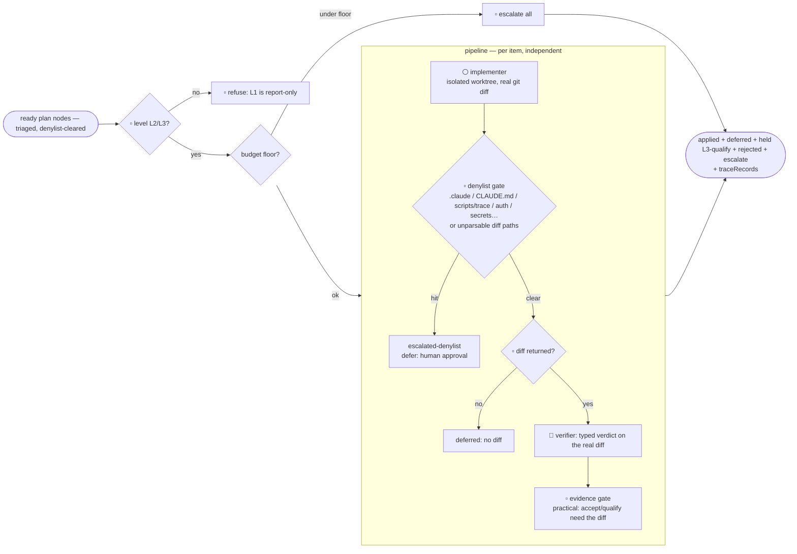
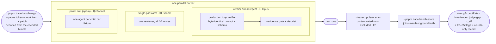

# Workflow graphs

Visual map of every deterministic multi-agent Workflow under `.claude/workflows/`.
Each is a **graph**: nodes = subagents (own context), edges = data hand-offs. This is
the "see the graph before you run it" view (the diagram-first idea from graph
engineering), kept in-repo so it version-controls alongside the scripts.

**Model tiering** (graph-engineering convention): high-volume fan-out runs on the
**fast tier** (Sonnet); gates, judgment, and synthesis run on the **strong tier**
(Opus). The loop implementer is the deliberate exception — it writes real code, so it
inherits the session model instead of being downgraded. All tiers are overridable via
`args.models = { fanout, judge }`.

> Legend: 🟢 fast tier (Sonnet) · 🔵 strong tier (Opus) · ⚪ inherits session model ·
> ▫️ plain code (no agent). Barriers (`parallel`) collect all nodes before the next
> stage; pipelines (`pipeline`) flow each item through independently.

---

## `critic-panel` — critic round (`/critic-round`, `/multi-agent-dev`, `/qa-pass`, `/loop`)

```mermaid
flowchart LR
  focus([focus / changed files]) --> R
  subgraph R["Review — parallel barrier · 🟢 Sonnet"]
    c1[First-Time User]
    c2[UX Flow]
    c3[Designer]
    c4[Artistic Direction]
    c5[Frontend Arch]
    c6[QA / E2E]
    c7[Accessibility]
    c8[Performance]
    c9[Security]
    c10[Regression]
  end
  R --> dedup[▫️ merge-dedup<br/>agreement ≠ evidence; keep only<br/>independent evidence]
  dedup --> reuse{▫️ same claim (lens+title+type),<br/>licensing verdict, still-present,<br/>identical tree?}
  reuse -- yes --> reused[▫️ reuse prior verdict<br/>→ REUSE action]
  reuse -- no --> V
  subgraph V["Verify — one skeptic per blocker/important · 🔵 Opus"]
    v1[typed verdict #1<br/>+ lens critical questions]
    v2[typed verdict #2]
    vn[typed verdict #N]
  end
  V --> gate[▫️ strict evidence gate<br/>accept+qualify floor, under critic AND skeptic type]
  gate --> out([confirmed accept/qualify · deferred · revised · refuted<br/>+ failedReviewers + traceRecords + reuseActions])
  reused --> out
```

> Prior verdicts come in via `args.priorRecords` (`pnpm -s trace query --latest --writer
> critic-panel --brief`) + `args.treeId` (`pnpm -s trace tree-id`). The evidence gate is the canonical
> `<trace-evidence-gate>` block (byte-identical to `scripts/trace/lib.mjs`).
>
> `uiInScope: false` drops the 5 UI-facing critics (First-Time User, UX Flow, Designer,
> Artistic Direction, Accessibility) for non-UI (backend / docs / config) changes, and such a
> code-only round also switches the Review stage to **one** all-lens reviewer
> (`reviewMode: 'single-pass'`, 🟢 Sonnet, label `critic:all-lenses-0`) — TRACE-Bench-lite
> measured it equal to the panel on code-only review at ~5x lower cost (F1). Each finding
> keeps its lens and still gets its own skeptic, so everything after Review is unchanged.
> The 10-node graph above is the default/full case (`args.reviewMode` overrides).

## `improve-skills` — meta-critic over our own prompts (`/improve-skills`)

```mermaid
flowchart LR
  surface([.claude prompt + workflow surface]) --> R
  subgraph R["Review — per lens, parallel · 🟢 Sonnet"]
    l1[Clarity]
    l2[Instruction-following risk]
    l3[Safety / gating]
    l4[Consistency / DRY]
    l5[Workflow DSL / schema]
    l6[Routing / discoverability]
  end
  R --> dedup[▫️ merge-dedup]
  dedup --> gate{budget floor?}
  gate -- "under floor" --> skip[▫️ skip verify →<br/>deferred, unverified]
  gate -- ok --> V
  subgraph V["Verify — 2-axis skeptic per finding · 🔵 Opus"]
    v1[real? + editSafe? + saferEdit]
  end
  V --> map[▫️ two axes → TRACE verdict<br/>then evidence gate (normative: cited rule)]
  map --> out([applyReady + needsDesign + deferred + refuted<br/>+ traceRecords])
  skip --> out
```

## `scan-docs` — evidence-based story status (`/scan-project-docs`)

```mermaid
flowchart LR
  stories([stories]) --> P
  subgraph P["pipeline — per story, independent"]
    e[🟢 gather code+test evidence] --> nr{▫️ report returned?}
    nr -- no --> d0[defer: status unchanged]
    nr -- yes --> v[🔵 strict status verifier<br/>cites evidenceChecked + missing]
  end
  P --> map[▫️ proposed vs verified status →<br/>verdict, then evidence gate (factual)]
  map --> out([per-story status records + traceRecords])
```

## `gap-analysis` — docs↔code↔tests gaps (`/story-gap-analysis`)



## `e2e-design` — Playwright case enumeration (`/multi-agent-e2e`)


## `loop-iteration` — maker/checker for `/loop` L2/L3



## `trace-bench` — measure the checkers (`/bench-checkers`)



> The shared blocks (`<trace-evidence-gate>`, `<loop-denylist>`, `<loop-verifier>`,
> `<critic-roster>`) are byte-identical copies of production — `pnpm test` fails on
> drift, so the bench always measures the checker that actually runs.

---

## How to regenerate

These diagrams are hand-maintained to mirror `.claude/workflows/*.js`. When you add a
node, change a tier, or add an edge, update the matching diagram here. `/improve-skills`
(Consistency lens) and `/dream lint` should flag a diagram that has drifted from its
script.
