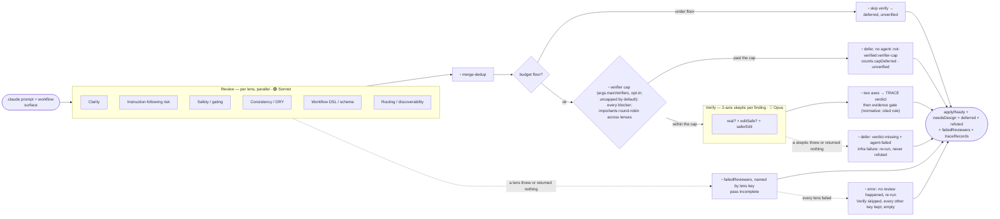
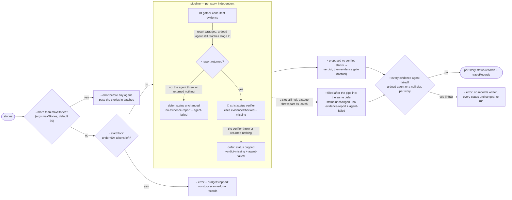
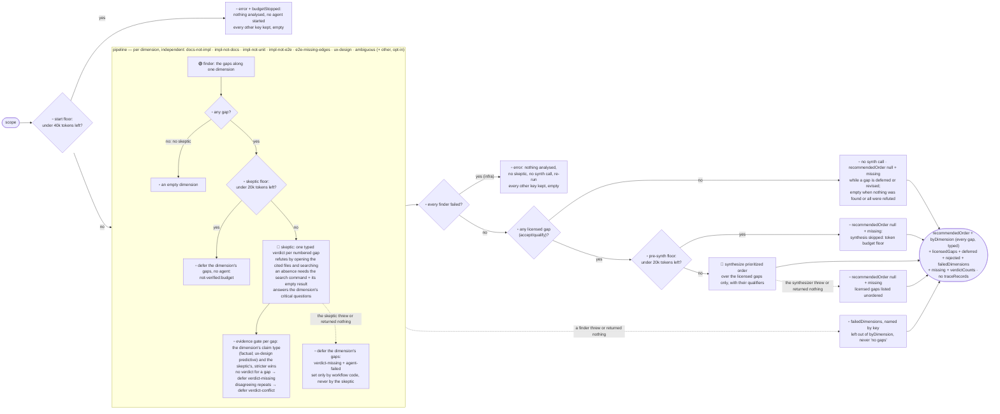
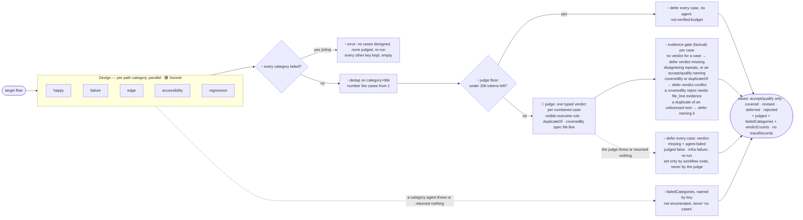
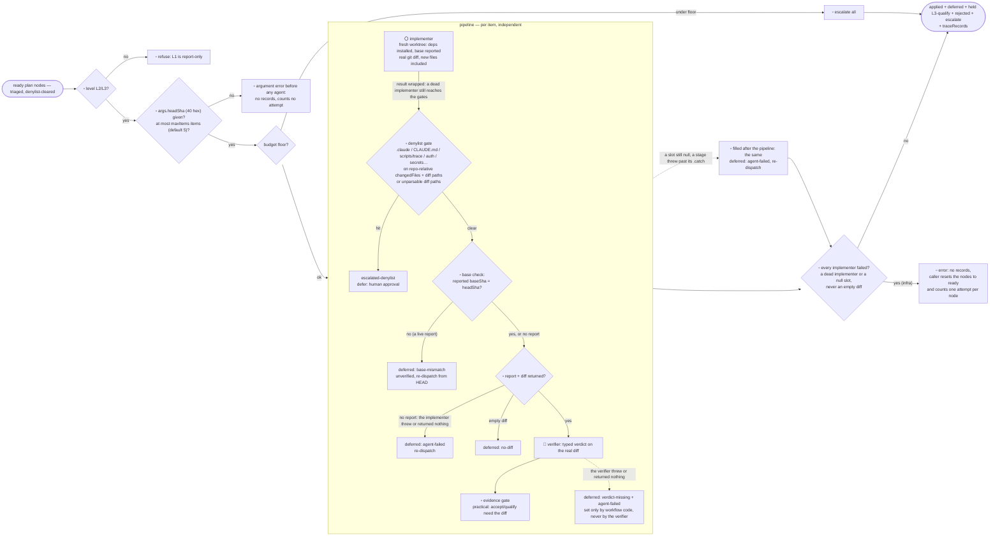

# Workflow graphs

Visual map of every deterministic multi-agent Workflow under `.claude/workflows/`.
Each is a **graph**: nodes = subagents (own context), edges = data hand-offs. This is
the "see the graph before you run it" view (the diagram-first idea from graph
engineering), kept in-repo so it version-controls alongside the scripts.

**Model tiering** (graph-engineering convention): high-volume fan-out runs on the
**fast tier** (Sonnet); gates, judgment, and synthesis run on the **strong tier**
(Opus). The loop implementer is the deliberate exception — it writes real code, so it
inherits the session model instead of being downgraded. All tiers are overridable via
`args.models = { fanout, judge }`.

> Legend: 🟢 fast tier (Sonnet) · 🔵 strong tier (Opus) · ⚪ inherits session model ·
> ▫️ plain code (no agent). Barriers (`parallel`) collect all nodes before the next
> stage; pipelines (`pipeline`) flow each item through independently. Dotted edges are
> agent-failure paths: an agent that throws or returns nothing is caught and recorded (a
> failed reviewer, an `agent-failed` defer, or a `noVerdict` bench run), never dropped.
> The engine ends a pipeline item at the first stage that resolves to `null`: its later
> stages never run and its slot is `null`, as it is when a stage throws. So `scan-docs` and
> `loop-iteration` wrap their first agent's result (a dead agent still reaches stage 2,
> which defers it as `agent-failed`) and fill a slot still `null` after the pipeline with
> the same defer; `gap-analysis` reads a `null` slot as a failed dimension.

**Agent SAFETY.** Every agent that `critic-panel`, `improve-skills`, `scan-docs`,
`gap-analysis` and `e2e-design` start gets the same `<agent-safety>` block in its prompt
(byte-identical in the five scripts; `pnpm test` fails on drift and on a prompt without
it). The repo checkout is shared, so it is read-only for those agents: they read, search
and run read-only git there, run any check or trial edit in a `mktemp -d` copy of the
working tree, never run `pnpm dev`, `pnpm test:e2e` or `pnpm verify`, and never start or
kill a server. In a critic round, E2E, axe and bundle results come from the Lead's
`args.priorEvidence`, which every critic and every skeptic receives. The skeptic's copy is
labelled as the Lead's command output, so it can cite an axe run or a bundle figure there as a
measurement and a test run as a command. A result that is absent is reported as missing evidence.
`loop-iteration` and `trace-bench` do not carry the block: the implementer works in its
own worktree under its own rules (no dev, build, E2E or verify; no commit, push, stash or
reset), and the loop verifier and the bench arms are measured prompts, so adding it there
needs a re-bench.

**Cost bounds.** Where the agent count is known up front, a workflow refuses an over-size
batch before any agent starts (`scan-docs`: `args.maxStories`, default 30; `loop-iteration`:
`args.maxItems`, default 5). A verifier cap
turns the overflow into recorded defers instead of dropping it (`critic-panel`:
`args.maxVerifiers`, default 30; `improve-skills`: opt-in, uncapped by default). Budget
floors compare `budget.remaining()` (output tokens left in the turn's shared pool) with a
fixed number, and fire only when the turn has a `+Nk` token target: without one,
`budget.total` is null and no floor fires.

---

## `critic-panel` — critic round (`/critic-round`, `/multi-agent-dev`, `/qa-pass`, `/loop`)

```mermaid
flowchart LR
  focus([focus / changed files]) --> sf{"▫️ start floor:<br/>under 80k tokens left?"}
  sf -- yes --> bs[▫️ error + budgetStopped: no agent started<br/>every in-scope lens in failedReviewers<br/>completeness too, when on]
  bs --> comp
  sf -- no --> R
  subgraph R["Review — parallel barrier · 🟢 Sonnet"]
    c1[First-Time User]
    c2[UX Flow]
    c3[Designer]
    c4[Artistic Direction]
    c5[Frontend Arch]
    c6[QA / E2E]
    c7[Accessibility]
    c8[Performance]
    c9[Security]
    c10[Regression]
  end
  R --> dedup[▫️ merge-dedup<br/>agreement ≠ evidence; keep only<br/>independent evidence]
  dedup --> cov{"▫️ args.completeness: true?<br/>opt-in, off by default, unmeasured"}
  cov -- no --> reuse{"▫️ same claim (lens+title+type),<br/>licensing verdict, still-present,<br/>identical tree?"}
  cov -- yes --> cf{"▫️ every in-scope lens failed,<br/>or under 60k tokens left (verify floor)?"}
  cf -- yes --> ns[▫️ not started: completeness in failedReviewers<br/>completion.missing says why]
  ns --> reuse
  cf -- no --> C["Coverage — one completeness critic · 🟢 Sonnet<br/>critic:completeness-0, given the lenses reviewed<br/>and the titles already raised: the important problem<br/>the round missed"]
  C --> cm["▫️ merge as critic 'completeness'<br/>a repeat of a raised finding merges, never corroborates"]
  cm --> reuse
  reuse -- yes --> reused[▫️ reuse prior verdict<br/>→ REUSE action · takes no verifier slot]
  reuse -- no --> vf{"▫️ verify floor:<br/>under 60k tokens left?"}
  vf -- yes --> bd[▫️ defer, no agent: not-verified:budget<br/>every fresh blocker and important finding]
  bd --> comp
  vf -- no --> cap{"▫️ verifier cap (args.maxVerifiers, default 30):<br/>every blocker; important findings fill<br/>the slots left, round-robin across lenses<br/>(the completeness lens last)"}
  cap -- "past the cap" --> cd[▫️ defer, no agent: not-verified:verifier-cap<br/>counts.capDeferred · verified next round]
  cd --> comp
  cap -- "within the cap" --> V
  subgraph V["Verify — one skeptic per blocker, and per important up to the cap · 🔵 Opus"]
    v1["typed verdict #1<br/>+ lens critical questions<br/>+ the Lead's priorEvidence, when given"]
    v2[typed verdict #2]
    vn[typed verdict #N]
  end
  V --> gate[▫️ strict evidence gate<br/>accept+qualify floor, under critic AND skeptic type]
  gate --> comp
  reused --> comp
  comp["▫️ completion, computed in code: claim 'no open blocker in focus'<br/>reject = a blocker confirmed · defer = a failed or unstarted lens, a single-pass finding<br/>tagged with no in-scope lens, a deferred or revised blocker, or an open prior blocker<br/>in a lens not reviewed · else accept<br/>+ notRechecked = prior records of the lenses not reviewed"]
  comp --> out([completion · confirmed accept/qualify · deferred, cap and budget defers included<br/>· revised · refuted + failedReviewers + counts.capDeferred + traceRecords + reuseActions])
  R -.->|a critic threw or returned nothing| fr[▫️ failedReviewers, named by lens key<br/>round incomplete, never a clean pass]
  C -.->|it threw or returned nothing| fr
  fr --> comp
  fr -.->|every lens failed| err[▫️ error: no review happened, re-run<br/>every other key kept, empty]
  err --> out
  V -.->|a skeptic threw or returned nothing| af[▫️ defer: verdict-missing + agent-failed<br/>infra failure: re-run, never refuted<br/>set only by workflow code, never by a skeptic]
  af --> comp
```

> Prior verdicts come in via `args.priorRecords` (`pnpm -s trace query --latest --writer
> critic-panel --brief`) + `args.treeId` (`pnpm -s trace tree-id`). The evidence gate is the canonical
> `<trace-evidence-gate>` block (byte-identical to `scripts/trace/lib.mjs`).
>
> `uiInScope: false` drops the 5 UI-facing critics (First-Time User, UX Flow, Designer,
> Artistic Direction, Accessibility) for non-UI (backend / docs / config) changes, and such a
> code-only round also switches the Review stage to **one** all-lens reviewer
> (`reviewMode: 'single-pass'`, 🟢 Sonnet, label `critic:all-lenses-0`) — TRACE-Bench-lite
> measured it equal to the panel on code-only review at ~5x lower cost (F1; one 19-fixture
> run, 5 of 10 critics, diff-level block/no-block with the bench's own prompt). Each finding
> keeps its lens, so everything after Review is unchanged: every blocker, and each important
> finding up to the verifier cap, gets a typed verdict from a separate skeptic; the rest are
> recorded as defers.
> The 10-node graph above is the default/full case (`args.reviewMode` overrides).
>
> A round is clean only when `completion.verdict` is `accept`; callers print `error` and
> `completion` before the matrix and never CLEAR a record in `completion.notRechecked`
> (Round integrity in `.claude/memory/topics/trace.md`). `completion` is derived, not
> written as a record.
>
> Cost bounds: below the start floor the round returns `error` and `budgetStopped` with
> every key kept, and its completion comes from the same code as any round (`defer`, each
> in-scope lens's `missing` naming the floor). Cap and budget defers are records like any
> other defer; a deferred blocker keeps completion at `defer`, and a cap never defers a
> blocker.
>
> Opt-in completeness critic (`args.completeness: true`; off by default and unmeasured, so bench
> it before turning it on by default): after the merge-dedup, phase `Coverage` starts one more
> agent (`critic:completeness-0`, the critics' read-only brief and SAFETY block) with the lenses
> reviewed and the titles already raised, and asks for the important problem the round missed.
> Its findings merge as critic `completeness` and take the same reuse, cap, skeptic, gate and
> record path (`critic:completeness:<slug>`); in the cap's round-robin its important findings come
> after every roster lens, and its skeptic also gets the focus and the titles already raised, which
> its critical questions ask about. The lens is defined outside `<critic-roster>`, so the bench
> roster is untouched. If the agent dies, or does not start (below the start or verify floor, or
> when every in-scope lens failed: an error round writes no records), the roster's findings still
> take the reuse, verify-floor, cap and skeptic path, `failedReviewers` names `completeness`, and
> completion is at least `defer` (`reject` when a blocker is confirmed); it never makes or prevents
> `error`. Off, dead or not started, its prior records stay in `notRechecked`.

## `improve-skills` — meta-critic over our own prompts (`/improve-skills`; skill: `prompt-meta-critic`)

```mermaid
flowchart LR
  surface([.claude prompt + workflow surface]) --> R
  subgraph R["Review — per lens, parallel · 🟢 Sonnet"]
    l1[Clarity]
    l2[Instruction-following risk]
    l3[Safety / gating]
    l4[Consistency / DRY]
    l5[Workflow DSL / schema]
    l6[Routing / discoverability]
  end
  R --> dedup[▫️ merge-dedup]
  dedup --> gate{budget floor?}
  gate -- "under floor" --> skip[▫️ skip verify →<br/>deferred, unverified]
  gate -- ok --> cap{"▫️ verifier cap (args.maxVerifiers, opt-in;<br/>uncapped by default): every blocker;<br/>importants round-robin across lenses"}
  cap -- "past the cap" --> cd[▫️ defer, no agent: not-verified:verifier-cap<br/>counts.capDeferred · unverified]
  cd --> out
  cap -- "within the cap" --> V
  subgraph V["Verify — 2-axis skeptic per finding · 🔵 Opus"]
    v1[real? + editSafe? + saferEdit]
  end
  V --> map["▫️ two axes → TRACE verdict<br/>then evidence gate (normative: cited rule)"]
  map --> out([applyReady + needsDesign + deferred + refuted<br/>+ failedReviewers + traceRecords])
  skip --> out
  R -.->|a lens threw or returned nothing| fr[▫️ failedReviewers, named by lens key<br/>pass incomplete]
  fr --> out
  fr -.->|every lens failed| err[▫️ error: no review happened, re-run<br/>Verify skipped, every other key kept, empty]
  err --> out
  V -.->|a skeptic threw or returned nothing| af[▫️ defer: verdict-missing + agent-failed<br/>infra failure: re-run, never refuted]
  af --> out
```

## `scan-docs` — evidence-based story status (`/scan-project-docs`)

```mermaid
flowchart LR
  stories([stories]) --> ms{"▫️ more than maxStories?<br/>(args.maxStories, default 30)"}
  ms -- yes --> merr[▫️ error before any agent:<br/>pass the stories in batches]
  ms -- no --> sf{"▫️ start floor:<br/>under 60k tokens left?"}
  sf -- yes --> berr[▫️ error + budgetStopped:<br/>no story scanned, no records]
  sf -- no --> P
  subgraph P["pipeline — per story, independent"]
    e[🟢 gather code+test evidence] -- "result wrapped: a dead agent still reaches stage 2" --> nr{▫️ report returned?}
    nr -- "no: the agent threw or returned nothing" --> d0[defer: status unchanged<br/>no-evidence-report + agent-failed]
    nr -- yes --> v[🔵 strict status verifier<br/>cites evidenceChecked + missing]
    v -.->|the verifier threw or returned nothing| d1[defer: status capped<br/>verdict-missing + agent-failed]
  end
  P --> map["▫️ proposed vs verified status →<br/>verdict, then evidence gate (factual)"]
  P -.->|a slot still null, a stage threw past its .catch| lost[▫️ filled after the pipeline: the same defer<br/>status unchanged · no-evidence-report + agent-failed]
  map --> allf{"▫️ every evidence agent failed?<br/>a dead agent or a null slot, per story"}
  lost --> allf
  allf -- no --> out([per-story status records + traceRecords])
  allf -- "yes (infra)" --> err[▫️ error: no records written,<br/>every status unchanged, re-run]
```

## `gap-analysis` — docs↔code↔tests gaps + skeptic per dimension (`/story-gap-analysis`)

```mermaid
flowchart LR
  scope([scope]) --> sf{"▫️ start floor:<br/>under 40k tokens left?"}
  sf -- yes --> berr[▫️ error + budgetStopped:<br/>nothing analysed, no agent started<br/>every other key kept, empty]
  sf -- no --> P
  subgraph P["pipeline — per dimension, independent: docs-not-impl · impl-not-docs · impl-not-unit · impl-not-e2e · e2e-missing-edges · ux-design · ambiguous (+ other, opt-in)"]
    f[🟢 finder: the gaps along one dimension] --> ne{"▫️ any gap?"}
    ne -- "no: no skeptic" --> emp[▫️ an empty dimension]
    ne -- yes --> vf{"▫️ skeptic floor:<br/>under 20k tokens left?"}
    vf -- yes --> bd["▫️ defer the dimension's gaps, no agent:<br/>not-verified:budget"]
    vf -- no --> k["🔵 skeptic: one typed verdict per numbered gap<br/>refutes by opening the cited files and searching<br/>an absence needs the search command + its empty result<br/>answers the dimension's critical questions"]
    k --> gate["▫️ evidence gate per gap: the dimension's claim type<br/>(factual; ux-design predictive) and the skeptic's, stricter wins<br/>no verdict for a gap → defer verdict-missing<br/>disagreeing repeats → defer verdict-conflict"]
    k -.->|the skeptic threw or returned nothing| af["▫️ defer the dimension's gaps:<br/>verdict-missing + agent-failed<br/>set only by workflow code, never by the skeptic"]
  end
  P --> allf{"▫️ every finder failed?"}
  allf -- "yes (infra)" --> err[▫️ error: nothing analysed,<br/>no skeptic, no synth call, re-run<br/>every other key kept, empty]
  allf -- no --> lic{"▫️ any licensed gap<br/>(accept/qualify)?"}
  lic -- no --> nl["▫️ no synth call · recommendedOrder null + missing<br/>while a gap is deferred or revised;<br/>empty when nothing was found or all were refuted"]
  nl --> out
  lic -- yes --> pf{"▫️ pre-synth floor:<br/>under 20k tokens left?"}
  pf -- yes --> nsb[▫️ recommendedOrder null + missing:<br/>synthesis skipped: token budget floor]
  nsb --> out
  pf -- no --> s[🔵 synthesize prioritized order<br/>over the licensed gaps only, with their qualifiers]
  s --> out(["recommendedOrder + byDimension (every gap, typed)<br/>+ licensedGaps + deferred + rejected + failedDimensions<br/>+ missing + verdictCounts · no traceRecords"])
  P -.->|a finder threw or returned nothing| fd["▫️ failedDimensions, named by key<br/>left out of byDimension, never 'no gaps'"]
  fd --> out
  s -.->|the synthesizer threw or returned nothing| ns[▫️ recommendedOrder null + missing<br/>licensed gaps listed unordered]
  ns --> out
```

> A finder never licenses its own gaps: one separate skeptic per non-empty dimension tries to
> refute them, and the canonical `<trace-evidence-gate>` block settles each verdict under the
> stricter of the dimension's claim type and the skeptic's. A `factual` gap's `accept` or
> `qualify` citing only `reading` becomes `defer`; a `ux-design` gap not observed in the browser
> or by a human is at most `qualify`. Only `accept`/`qualify` gaps reach the synthesizer; every
> gap stays in `byDimension` with its verdict, and `deferred`/`rejected` list those across
> dimensions. The verdicts are advisory: `gap-analysis` writes no records and no durable state
> changes on its output. The catch-all `other` dimension runs only with
> `args.completeness: true`; its anti-scope is the seven dimensions above, and its gaps face the
> same skeptic and gate. Each skeptic reuses the pre-synth floor value (20k).

## `e2e-design` — Playwright case enumeration + judge (`/multi-agent-e2e`)

```mermaid
flowchart LR
  flow([target flow]) --> D
  subgraph D["Design — per path category, parallel · 🟢 Sonnet"]
    d1[happy]
    d2[failure]
    d3[edge]
    d4[accessibility]
    d5[regression]
  end
  D --> allf{"▫️ every category failed?"}
  allf -- "yes (infra)" --> err[▫️ error: no cases designed, none judged, re-run<br/>every other key kept, empty]
  allf -- no --> dedup[▫️ dedup on category+title<br/>number the cases from 1]
  dedup --> jf{"▫️ judge floor:<br/>under 20k tokens left?"}
  jf -- yes --> bd[▫️ defer every case, no agent:<br/>not-verified:budget]
  bd --> out
  jf -- no --> J["🔵 judge: one typed verdict per numbered case<br/>visible-outcome rule · duplicateOf · coveredBy spec file:line"]
  J --> gate["▫️ evidence gate (factual) per case<br/>no verdict for a case → defer verdict-missing<br/>disagreeing repeats, or an accept/qualify naming<br/>coveredBy or duplicateOf → defer verdict-conflict<br/>a coveredBy reject needs file_line evidence<br/>a duplicate of an unlicensed twin → defer naming it"]
  gate --> out(["cases: accept/qualify only · covered · revised · deferred · rejected<br/>+ judged + failedCategories + verdictCounts · no traceRecords"])
  D -.->|a category agent threw or returned nothing| fc["▫️ failedCategories, named by key<br/>not enumerated, never 'no cases'"]
  fc --> out
  J -.->|the judge threw or returned nothing| af[▫️ defer every case: verdict-missing + agent-failed<br/>judged false · infra failure: re-run<br/>set only by workflow code, never by the judge]
  af --> out
```

> The judge never licenses a case on its enumerator's word: each verdict is settled as a
> `factual` claim by the canonical `<trace-evidence-gate>` block, so an `accept` or `qualify`
> citing only `reading` becomes `defer`. The verdicts are advisory: `e2e-design` writes no
> records and no durable state changes on its output. The caller implements `cases` only; a
> `revised` case's `repair` is a new claim for the post-implementation round. `covered` cases
> and duplicate rejects are not coverage gaps; deferred, revised and unobservable (no
> `duplicateOf`) rejected cases are. With no proposed case, no judge starts (`judged: false`).

## `loop-iteration` — maker/checker for `/loop` L2/L3

```mermaid
flowchart LR
  items([ready plan nodes — triaged, denylist-cleared]) --> lvl{▫️ level L2/L3?}
  lvl -- no --> err[▫️ refuse: L1 is report-only]
  lvl -- yes --> argc{"▫️ args.headSha (40 hex) given?<br/>at most maxItems items (default 5)?"}
  argc -- no --> aerr[▫️ argument error before any agent:<br/>no records, counts no attempt]
  argc -- yes --> budget{budget floor?}
  budget -- "under floor" --> esc0[▫️ escalate all]
  budget -- ok --> P
  subgraph P["pipeline — per item, independent"]
    impl[⚪ implementer<br/>fresh worktree: deps installed, base reported<br/>real git diff, new files included] -- "result wrapped: a dead implementer still reaches the gates" --> dl{▫️ denylist gate<br/>.claude / CLAUDE.md / scripts/trace / auth / secrets…<br/>on repo-relative changedFiles + diff paths<br/>or unparsable diff paths}
    dl -- hit --> escd[escalated-denylist<br/>defer: human approval]
    dl -- clear --> bm{"▫️ base check:<br/>reported baseSha = headSha?"}
    bm -- "no (a live report)" --> dbm[deferred: base-mismatch<br/>unverified, re-dispatch from HEAD]
    bm -- "yes, or no report" --> nd{▫️ report + diff returned?}
    nd -- "no report: the implementer threw or returned nothing" --> daf[deferred: agent-failed<br/>re-dispatch]
    nd -- "empty diff" --> dfr[deferred: no-diff]
    nd -- yes --> ver[🔵 verifier: typed verdict on the real diff]
    ver --> eg[▫️ evidence gate<br/>practical: accept/qualify need the diff]
    ver -.->|the verifier threw or returned nothing| vaf[deferred: verdict-missing + agent-failed<br/>set only by workflow code, never by the verifier]
  end
  P -.->|a slot still null, a stage threw past its .catch| lost[▫️ filled after the pipeline: the same<br/>deferred: agent-failed, re-dispatch]
  P --> allf{"▫️ every implementer failed?<br/>a dead implementer or a null slot,<br/>never an empty diff"}
  lost --> allf
  allf -- no --> out([applied + deferred + held L3-qualify + rejected + escalate<br/>+ traceRecords])
  allf -- "yes (infra)" --> erri[▫️ error: no records,<br/>caller resets the nodes to ready<br/>and counts one attempt per node]
  esc0 --> out
```

> `args.headSha` is the Lead's `git rev-parse HEAD`. Each implementer reports the commit its
> worktree started from (`baseSha`), and a live report based on another commit is deferred
> `base-mismatch` before verification: set `worktree.baseRef` to `"head"` so loop worktrees
> branch from local HEAD. The stage gates run in a fixed order: denylist, base check, then
> `agent-failed` / `no-diff`, then the verifier. A dead implementer reaches them through its
> wrapped result and is deferred `agent-failed` there; a slot that still comes back `null` (a
> stage threw past its `.catch`) gets the same defer after the pipeline, and both count toward
> the infra `error`. The denylist gate reads `changedFiles` repo-relative (a path inside
> `.claude/worktrees/<name>/` is no `.claude/` hit; a path that begins `.claude/` still is),
> while the verifier gets the report exactly as returned. An argument error starts no agent
> and counts no attempt; the infra `error` counts one per node.
> Like `agent-failed`, `base-mismatch` is set only by workflow code: both let the Lead
> re-dispatch a node without new evidence, so the verifier stage drops either one from a
> live verifier's own `failedGates`.

## `trace-bench` — measure the checkers (`/bench-checkers`)

```mermaid
flowchart LR
  args([pnpm trace bench-args<br/>opaque token + work item + patch<br/>decoded from the encoded bundle]) --> T
  subgraph T["one parallel barrier"]
    subgraph VA["verifier arm × repeat · 🔵 Opus"]
      va[production loop verifier<br/>byte-identical prompt + schema] --> vg[▫️ evidence gate + denylist]
    end
    subgraph SA["single-pass arm · 🟢 Sonnet"]
      sp[one reviewer, all 10 lenses]
    end
    subgraph PA["panel arm (opt-in) · 🟢 Sonnet"]
      pc[one agent per critic per fixture]
    end
  end
  T --> runs([raw runs + agents started])
  T -.->|an agent threw or returned nothing| nv[▫️ noVerdict run<br/>counted, never dropped]
  nv --> runs
  runs --> scan[▫️ transcript leak scan<br/>contaminated runs excluded · F0]
  scan --> score[▫️ pnpm trace bench-score<br/>joins manifest ground truth<br/>no-verdict runs excluded, missing runs counted · F0]
  score --> rep([WrongAcceptRate · invariance · judge gap · n_eff<br/>+ F0–F5 flags + counts-only record])
```

> The shared blocks (`<trace-evidence-gate>`, `<loop-denylist>`, `<loop-verifier>`,
> `<critic-roster>`) are byte-identical copies of production — `pnpm test` fails on
> drift, so the bench always measures the checker that actually runs.

---

## How to regenerate

These diagrams are hand-maintained to mirror `.claude/workflows/*.js`. When you add a
node, change a tier, or add an edge, update the matching diagram here. `/improve-skills`
(Consistency lens) and `/dream lint` should flag a diagram that has drifted from its
script. `pnpm test` checks two things mechanically: every workflow has a section headed
with its file name, and each agent a stub run starts carries its model's tier marker on
its node (the "model tiers" check in `scripts/trace/workflows.test.mjs` maps each agent
to its node).
